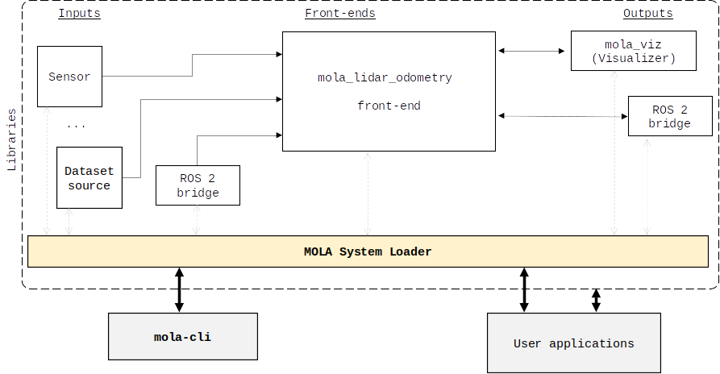
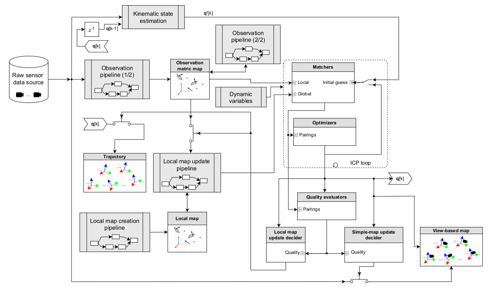

.. _mola_lidar_odometry:

============================
LiDAR odometry
============================

:octicon:`mark-github` `MOLA LiDAR odometry (MOLA-LO) <https://github.com/MOLAorg/mola_lidar_odometry/>`_ is
the main MOLA component for 3D and 2D LiDAR odometry and localization.
It is designed to provide accurate and robust motion tracking, with a
default configuration provided to **work out of the box** for you without
parameter tuning: it works for **16 to 128** ring LiDARs,
indoors or outdoors, with motion profiles ranging from
hand-held, slow wheeled or quadruped robots, to fast vehicles on highways.

This page explains the role of this component in the MOLA ecosystem,
how to deal with generated maps, and gives a glimpse into its internal
theoretical design.

.. note::
  After :ref:`installing <installing>` and getting familiar with the core ideas,
  you can jump into running some demos with
  the :ref:`provided GUI applications <mola_lo_apps>`,
  the :ref:`CLI interface <mola_lidar_odometry_cli>`,
  or learn how to :ref:`build a map from your own ROS 2 bag dataset <mola_lo_ros>`.

.. contents::
   :depth: 1
   :local:
   :backlinks: none

.. raw:: html

   

     <video controls autoplay loop muted style="width: 512px;">
       <source src="https://mrpt.github.io/videos/mola_main_page_video.mp4" type="video/mp4">
     </video>
   

|

.. _mola-lo-role:

Role within the MOLA ecosystem
----------------------------------

At a conceptual level, an odometry module takes **raw sensory data** as input
and outputs an **estimated trajectory** of the sensor or vehicle.

By picking a subset of the **input raw data** and pairing them with the **corresponding
pose** at which it was sensed, we can build a sparse "graph" of tuples "(Observation, pose)".
We dub such data structure **view-based map** or **simple-map**.

.. figure:: imgs/odometry_inputs_outputs.png
   :width: 400

   Role of an "odometry" module (Figure adapted from :cite:`blanco2024mola_lo`).

**Simple-maps** can then be used as input to :ref:`mp2p_icp applications <mp2p_icp_applications>` for analysis, filtering,
or creation of arbitrarily-complex **metric maps** of different kinds, like point clouds, voxel maps, 2D grid maps, etc.
Refer to :ref:`mp2p_icp_basics`.
Most often, users might be interested in **analyzing generated simple-maps** with :ref:`sm-cli <app_sm-cli>`,
in **generating metric maps** using :ref:`sm2mm <app_sm2mm>`,
and in **visualizing those maps** with  :ref:`mm-viewer <app_mm-viewer>`.

MOLA-LO is provided as the C++ class `mola::LidarOdometry <class_mola_LidarOdometry.html>`_, which 
implements the `mola::ExecutableBase` interface so it is able to communicate
with other input and output MOLA modules:

   Scheme of MOLA launcher with input, output, and a LO module (modified from :cite:`blanco2019modular`).

As shown in the figure above, once encapsulated within a MOLA application container,
the LO module can take **input sensory data** from other MOLA input modules, 
and the live LO output can optionally be either **visualized** in the ``mola_viz`` GUI,
and/or **published** to an external ROS 2 system.

Therefore, the most flexible way to use MOLA LO is by means of **different combinations
of input and output modules**, depending on what are the desired input data sources,
and that is defined by means of **mola-cli launch files**.

:ref:`mola-cli <mola-launcher>` is a standalone command line interface (CLI) program
provided by the `mola_launcher <https://github.com/MOLAorg/mola/tree/develop/mola_launcher>`_ package.
**Predefined launch files** `are provided <https://github.com/MOLAorg/mola_lidar_odometry/tree/develop/mola-cli-launchs>`_
for common tasks like running MOLA-LO on well-known public datasets 
or from rosbags.
However, to make thinks simpler, a set of executable scripts are provided
to make launching them easier: :ref:`MOLA GUI apps <mola_lo_apps>`.

Apart of this way to run MOLA-LO, two additional ways are provided for convenience: 

* :ref:`mola-lidar-odometry-cli <mola_lidar_odometry_cli>`: this standalone program
  is provided as a way to **process a given dataset as fast as possible**, without
  any interaction with GUIs, message subscription or reception, etc.
  It is also great for scripting and automating SLAM pipelines from raw datasets or rosbags.
* :ref:`ROS 2 integration <mola_lo_ros>`: ROS 2 launch files are also provided for easier integration
  for real-time odometry and mapping.

|

.. _mola-internal-arch:

Internal architecture
-------------------------

Internally, MOLA LO is based on mp2p_icp filtering and ICP pipelines:

   Block diagram of the MOLA-LO module (Figure adapted from :cite:`blanco2024mola_lo`).

Most blocks in the diagram above can be redefined without coding, just changing the :ref:`MOLA-LO pipeline configuration YAML file <>`.
Refer to the MOLA LO paper for further details.

.. note::

  You cannot debug what you cannot see. A powerful GUI named :ref:`icp-log-viewer <app_icp-log-viewer>`
  is provided to carefully inspect the internals of ICP optimization iterations.

How to cite it
-------------------------

The ``mola_lidar_odometry`` system was presented in :cite:`blanco2024mola_lo`:

  J.L. Blanco,
  `A flexible framework for accurate LiDAR odometry, map manipulation, and localization <https://arxiv.org/abs/2407.20465>`_, in
  ArXiV, 2024.
