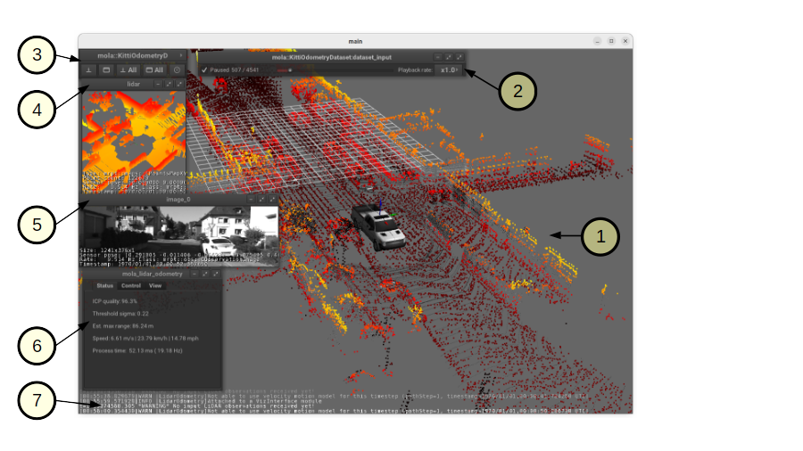

.. _launching_mola_lo:

Launching MOLA-LO
^^^^^^^^^^^^^^^^^^^
.. contents::
   :depth: 1
   :local:
   :backlinks: none

.. _mola_lo_apps:

============================
1. MOLA-LO GUI applications
============================
All these commands are actually shortcuts (small scripts) to launch ``mola-cli`` and
one of the predefined mola-cli launch files containing one dataset source
and the ``mola_viz`` module, which enables the real-time GUI visualization.

First, we enumerate the existing scripts together with their specific environment variables
and CLI usage, next we list the environment variables common to all of them.

.. note::

    Apart of the environment variables defined here, which are **specific** to these
    mola-cli launch files (see: :ref:`role of MOLA-LO module <mola-lo-role>`),
    remember that there are **many additional parameters**
    associated to the LO pipeline YAML file, listed `here <pipelines_env_vars>`_.

.. _mola_lo_gui_common_parts:

Common elements of all GUI apps
---------------------------------
``mola_viz`` provides a unified API for all MOLA modules to display custom UI subwindows, controls, and 3D objects.
Next we describe how to manipulate or interpret the **common elements in this UI**, which is the same in all MOLA-LO
programs, except ``mola-lidar-odometry-cli`` which is explicitly design not to have any GUI.

The labeled parts in the GUI are:

1. The **main space** of the "main" GUI window: used to render the latest 3D local map, together with the incoming raw scan,
   the 3D vehicle model (if provided), etc. Use the `same mouse and keyboard shortcuts <https://docs.mrpt.org/reference/latest/tutorial-3d-navigation-cheatsheet.html>`_
   than in any MRPT 3D window to rotate the view, pan and zoom, etc. The rest of small windows floating in this large windows are
   dubbed **"subwindows"**.
2. **Dataset source UI**: All dataset sources (offline datasets, rawlog, rosbag2, etc.) offer a common API that can be operated
   through these controls to pause or resume the publication of observations to the LiDAR front-end or to change the playback speed.
   Most datasets also support directly jumping forth and back in time by clicking on the time slider
   (It is recommended to pause mapping and reset the map while doing so!).
3. **Main subwindows control panel**: You can minimize, restore, etc. subwindows from here.
4. **Raw LiDAR view**: A subwindow with the details (type of observation, timestamp, etc.) of incoming raw scans.
5. **Camera view**: Although not used by the LO, it is useful sometimes to **see** the environment from camera images.
6. **mola_lidar_odometry module own UI**: Direct access to the internals of the LO module. There are tabs providing direct access
   to variables that :ref:`normally can be set via environment variables <pipelines_env_vars>`, to make it easier to record a simple-maps directly from the GUI.
7. **Log messages** with priority higher than ``INFO`` will be dumped to both, the terminal, and to this scrolling transparent terminal at the bottom.

|

1.1. mola-lo-gui-kitti
------------------------------
Runs MOLA-LO on a sequence of the KITTI odometry dataset :cite:`geiger2013vision`.

.. dropdown:: How to run it
   :icon: checklist

   - Download the KITTI Odometry dataset and extract them anywhere, such as the files layout matches
     the expected tree structure described in :ref:`doxid-classmola_1_1_kitti_odometry_dataset`.
   - Set the environment variable ``KITTI_BASE_DIR`` to the root "KITTI" directory in the tree layout above:

     .. code-block:: bash

        export KITTI_BASE_DIR=/path/to/dataset/

   - And run it for the desired sequence number:

     .. code-block:: bash

        # mola-lo-gui-kitti SEQUENCE
        # SEQUENCE: 00,01,...21
        
        # Example:
        mola-lo-gui-kitti 00

.. raw:: html

   

     <video controls autoplay loop muted style="width: 100%;">
       <source src="https://mrpt.github.io/videos/mola-lo-gui-kitti_demo_00.mp4" type="video/mp4">
     </video>
   

.. dropdown:: Inner workings
   :icon: light-bulb

   - mola-cli launch file: `mola-cli-launchs/lidar_odometry_from_kitti.yaml <https://github.com/MOLAorg/mola_lidar_odometry/blob/develop/mola-cli-launchs/lidar_odometry_from_kitti.yaml>`_
   - Dataset C++ MOLA module: :ref:`doxid-classmola_1_1_kitti_odometry_dataset`

|

1.2. mola-lo-gui-kitti360
------------------------------
xxx

|

1.3. mola-lo-gui-mulran
------------------------------
xxx

|

1.4. mola-lo-gui-rawlog
------------------------------
xxx

|

.. _mola_lo_gui_rosbag2:

1.5. mola-lo-gui-rosbag2
------------------------------
This command will open the mola_viz GUI and build a map from ROS 2 bags:

     .. code-block:: bash

        # Usage for a single bag file:
        MOLA_LIDAR_TOPIC=/ouster/points \
        mola-lo-gui-rosbag2 /path/to/your/dataset.mcap

        # Usage for a directory with split bag files:
        # Note: in this case, the directory is expected to contain a metadata.yaml to determine "rosbag_storage_id".
        MOLA_LIDAR_TOPIC=/ouster/points \
        mola-lo-gui-rosbag2 /path/to/your/dataset_directory/

.. dropdown:: Does your bag lack ``/tf``?
    :icon: alert

    By default, MOLA will try to use ``tf2`` messages in the rosbag to find out the relative pose
    of the LiDAR sensor with respect to the vehicle frame (default: ``base_link``). If your system **does not** have ``tf`` data
    (for example, if you only launched the LiDAR driver node) you must then set the environment variable ``MOLA_USE_FIXED_LIDAR_POSE=true``
    to use the default (identity) sensor pose on the vehicle. So, launch it like: 

    .. code-block:: bash

        MOLA_USE_FIXED_LIDAR_POSE=true \
        MOLA_LIDAR_TOPIC=/ouster/points \
        mola-lo-gui-rosbag2 /path/to/your/dataset.mcap

Environment variables specific for ``mola-lo-gui-rosbag2``:

.. dropdown:: See complete mola launch YAML listing
    :icon: code-review

    File: `mola-cli-launchs/lidar_odometry_from_rosbag2.yaml <https://github.com/MOLAorg/mola_lidar_odometry/blob/develop/mola-cli-launchs/lidar_odometry_from_rosbag2.yaml>`_

    .. literalinclude:: ../../../mola_lidar_odometry/mola-cli-launchs/lidar_odometry_from_rosbag2.yaml
       :language: yaml

|

- ``MOLA_TIME_WARP`` (Default: 1.0): Time wrapping for rosbag replay.

- ``MOLA_DATASET_START_PAUSED`` (Default: false): Start with replay paused. Then can be resumed from the GUI.

- ``MOLA_TF_BASE_FOOTPRINT`` (Default: ``base_link``): Set to something else if your ``/tf`` tree does not have a ``base_link`` frame.

|

.. _mola-gui-apps-common-env-vars:

1.6. Common env variables
------------------------------

- ``MOLA_ODOMETRY_PIPELINE_YAML`` (Default: full path to installed ``lidar3d-default.yaml``): Can be set to override
  the default pipeline and experiment with custom MOLA-LO systems described through a modified YAML file.

|

.. _mola_lidar_odometry_cli:

============================
2. LiDAR odometry CLI
============================
``mola-lidar-odometry-cli`` is a standalone command line program to run
MOLA-LO on a dataset in an offline fashion.
The dataset is processed as fast as possible using all available CPU cores.
Its outputs include the vehicle trajectory (as a file in `TUM format <https://github.com/MichaelGrupp/evo/wiki/Formats#tum---tum-rgb-d-dataset-trajectory-format>`_)
and the :ref:`simple-map <mola-lo-role>`, which can be analyzed with :ref:`sm-cli <app_sm-cli>`
and used to generate metric maps using :ref:`sm2mm <app_sm2mm>`.

.. hint::

    We recommend using `evo <https://github.com/MichaelGrupp/evo>`_ to visualize
    and compare the output TUM trajectories. You can also use
    `mrpt::poses::CPose3DInterpolator <https://docs.mrpt.org/reference/latest/class_mrpt_poses_CPose3DInterpolator.html>`_
    to load and parse TUM files in C++, or its Python wrapped version within ``pymrpt``.

2.1. Usage examples
--------------------

Process a ROS 2 bag
~~~~~~~~~~~~~~~~~~~~~

    .. code-block:: bash

        mola-lidar-odometry-cli \
          -c $(ros2 pkg prefix mola_lidar_odometry)/share/mola_lidar_odometry/pipelines/lidar3d-default.yaml \
          --input-rosbag2 /PATH/TO/YOUR/rosbag.mcap \
          --lidar-sensor-label /ouster/points \
          --output-tum-path trajectory.tum \
          --output-simplemap myMap.simplemap

.. note::
    Remember changing ``--lidar-sensor-label /ouster/points`` to your actual raw (unfiltered) LiDAR topic (``sensor_msgs/PointCloud2``).

.. dropdown:: Does your bag lack ``/tf``?
    :icon: alert

    By default, ``mola-lidar-odometry-cl`` will try to use ``tf2`` messages in the rosbag to find out the relative pose
    of the LiDAR sensor with respect to the vehicle frame (default: ``base_link``). If your system **does not** have ``tf`` data
    (for example, if you only launched the LiDAR driver node) you must then set the environment variable ``MOLA_USE_FIXED_LIDAR_POSE=true``
    to use the default (identity) sensor pose on the vehicle. So, launch it like: 

    .. code-block:: bash

        MOLA_USE_FIXED_LIDAR_POSE=true \
        mola-lidar-odometry-cli \
          [...]  # the rest does not change.

.. dropdown:: Want to visualize the output in real-time?
    :icon: light-bulb

    ``mola-lidar-odometry-cli`` is explicitly designed to be as fast as possible by not interacting with any GUI or messaging system. 
    If you prefer to visualize the results as they are being processed, there are two options:

    * Use the built-in GUI in the provided apps: :ref:`mola-lo-gui-rosbag2 <mola_lo_apps>`.
    * Replay the bag with `ros2 bag play` and launch the :ref:`ROS 2 launch file <mola_lo_ros>` so you can use RViz2 or FoxGlove for visualization.aunch

.. dropdown:: More parameters
    :icon: list-unordered

    The ``lidar3d-default.yaml`` pipeline file defines plenty of :ref:`additional parameters and options <mola_3d_default_pipeline>` that you can explore.

|

Process a KITTI dataset sequence
~~~~~~~~~~~~~~~~~~~~~~~~~~~~~~~~~~~

First, make sure of downloading and extracting the dataset files following the layout
expected by mola::KittiDataset.
Then, set the ``KITTI_BASE_DIR`` environment variable and launch the desired sequence (e.g. ``00``) with:

    .. code-block:: bash

        export KITTI_BASE_DIR=/path/to/kitti_root

        mola-lidar-odometry-cli \
          -c $(ros2 pkg prefix mola_lidar_odometry)/share/mola_lidar_odometry/pipelines/lidar3d-default.yaml \
          --input-kitti-seq 00 \
          --output-tum-path kitti-00.tum

.. dropdown:: More parameters
    :icon: list-unordered

    The ``lidar3d-default.yaml`` pipeline file defines plenty of :ref:`additional parameters and options <mola_3d_default_pipeline>` that you can explore.

|

2.2. Complete list of arguments
-------------------------------

    .. code-block:: bash

        USAGE:

        mola-lidar-odometry-cli  [--input-paris-luco] [--input-mulran-seq
                                    <KAIST01>] [--input-kitti360-seq <00>]
                                    [--kitti-correction-angle-deg <0.205
                                    [degrees]>] [--input-kitti-seq <00>]
                                    [--input-rosbag2 <dataset.mcap>]
                                    [--input-rawlog <dataset.rawlog>]
                                    [--lidar-sensor-label <lidar1>] [--skip-first-n
                                    <Number of dataset entries to skip>]
                                    [--only-first-n <Number of dataset entries to
                                    run>] [--output-simplemap
                                    <output-map.simplemap>] [--output-tum-path
                                    <output-trajectory.txt>] [-l <foobar.so>] [-v
                                    <INFO>] -c <demo.yml> [--] [--version] [-h]

        Where: 

        --input-paris-luco
            INPUT DATASET: Use Paris Luco dataset (unique sequence=00)

        --input-mulran-seq <KAIST01>
            INPUT DATASET: Use Mulran dataset sequence KAIST01|KAIST01|...

        --input-kitti360-seq <00>
            INPUT DATASET: Use KITTI360 dataset sequence number 00|01|...|test_00
            |...

        --kitti-correction-angle-deg <0.205 [degrees]>
            Correction vertical angle offset (see Deschaud,2018)

        --input-kitti-seq <00>
            INPUT DATASET: Use KITTI dataset sequence number 00|01|...

        --input-rosbag2 <dataset.mcap>
            INPUT DATASET: rosbag2. Input dataset in rosbag2 format (*.mcap)

        --input-rawlog <dataset.rawlog>
            INPUT DATASET: rawlog. Input dataset in rawlog format (*.rawlog)

        --lidar-sensor-label <lidar1>
            If provided, this supersedes the values in the 'lidar_sensor_labels'
            entry of the odometry pipeline, defining the sensorLabel/topic name to
            read LIDAR data from. It can be a regular expression (std::regex)

        --skip-first-n <Number of dataset entries to skip>
            Skip the first N dataset entries (0=default, not used)

        --only-first-n <Number of dataset entries to run>
            Run for the first N steps only (0=default, not used)

        --output-simplemap <output-map.simplemap>
            Enables building and saving the simplemap for the mapping session

        --output-tum-path <output-trajectory.txt>
            Save the estimated path as a TXT file using the TUM file format (see
            evo docs)

        -l <foobar.so>,  --load-plugins <foobar.so>
            One or more (comma separated) *.so files to load as plugins

        -v <INFO>,  --verbosity <INFO>
            Verbosity level: ERROR|WARN|INFO|DEBUG (Default: INFO)

        -c <demo.yml>,  --config <demo.yml>
            (required)  Input YAML config file (required) (*.yml)

        --,  --ignore_rest
            Ignores the rest of the labeled arguments following this flag.

        --version
            Displays version information and exits.

        -h,  --help
            Displays usage information and exits.

|

.. _mola_lo_ros:

====================================
3. ROS 2 node
====================================
A **ROS 2 node** is provided for running MOLA-LO *live* on a robot or vehicle where sensor drivers
are already working and publishing ROS topics.

.. dropdown:: Does your system lack ``/tf``?
    :icon: alert

    By default, MOLA-LO will try to use ``tf2`` messages to find out the relative pose
    of the LiDAR sensor with respect to the vehicle frame (default: ``base_link``). If your system **does not** have ``tf`` data
    (for example, if you only launched the LiDAR driver node) you must then set the environment variable ``MOLA_USE_FIXED_LIDAR_POSE=true``
    to use the default (identity) sensor pose on the vehicle.

3.1. ROS 2 launch file: LiDAR odometry for KITTI
--------------------------------------------------

This demo launch file (`view sources <https://github.com/MOLAorg/mola_lidar_odometry/blob/develop/ros2-launchs/ros2-lidar-odometry-kitti.launch.py>`_)
runs **MOLA-LO** on a sequence of the KITTI odometry dataset :cite:`geiger2013vision`, 
**demonstrating a few features**:

* Launching and visualizing LO in both, ``mola_viz`` and ``RViz2`` (or use FoxGlove if preferred).
* How MOLA core modules and ``mola_lidar_odometry`` publish raw observations from a dataset, the local map,
  the estimated trajectory, and `/tf` for the vehicle and all sensors.

.. image:: https://mrpt.github.io/imgs/mola-lo-ros2-launch-demo-kitti.png

.. dropdown:: How to run it
   :icon: checklist

   - Download the KITTI Odometry dataset and extract them anywhere, such as the files layout matches
     the expected tree structure described in :ref:`doxid-classmola_1_1_kitti_odometry_dataset`.
   - Set the environment variable ``KITTI_BASE_DIR`` to the root "KITTI" directory in the tree layout above:

     .. code-block:: bash

        export KITTI_BASE_DIR=/path/to/dataset/

   - And run it for the desired sequence number:

     .. code-block:: bash

        ros2 launch mola_lidar_odometry ros2-lidar-odometry-kitti.launch.py kitti_sequence:=00

|

3.2. ROS 2 launch file: live LiDAR odometry
--------------------------------------------------

This launch file (`view sources <https://github.com/MOLAorg/mola_lidar_odometry/blob/develop/ros2-launchs/ros2-lidar-odometry.launch.py>`_)
runs **MOLA-LO** live on point clouds received from a ROS 2 topic, **demonstrating a few features**:

* Launching and visualizing LO in both, ``mola_viz`` and ``RViz2`` (or use FoxGlove if preferred).
* How MOLA ``mola_lidar_odometry``publishes the local map,
  the estimated trajectory, and `/tf` for the estimated odometry.

.. image:: https://mrpt.github.io/imgs/mola-lo-ros2-launch-demo-live-forest.png

.. dropdown:: How to run it
   :icon: checklist

   .. code-block:: bash

      # Basic usage (requires correct LiDAR sensor /tf):
      ros2 launch mola_lidar_odometry ros2-lidar-odometry.launch.py \
        lidar_topic_name:=/ouster/points

      # Usage without sensor /tf:
      ros2 launch mola_lidar_odometry ros2-lidar-odometry.launch.py \
        lidar_topic_name:=/ouster/points \
        ignore_lidar_pose_from_tf:=True

.. dropdown:: More parameters
    :icon: list-unordered

    The ``lidar3d-default.yaml`` pipeline file defines plenty of :ref:`additional parameters and options <mola_3d_default_pipeline>` that you can explore.

|

.. _mola_lo_ros1:

====================================
4. Running from ROS 1 bags
====================================
ROS 1 bags are not directly supported by MOLA-LO. However, given the large amount of public datasets
already published in this format, we provide two pathways to parse them.

4.1. Porting to ROS 2 bags
---------------------------------
Write me!

4.2. Converting to MRPT rawlog
---------------------------------
Write me!
